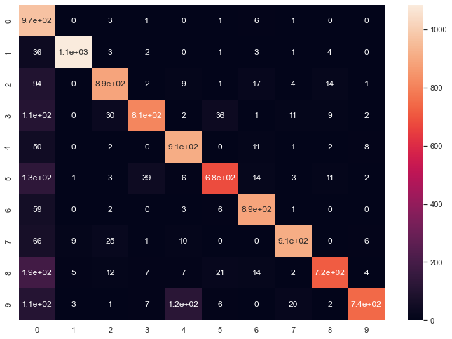
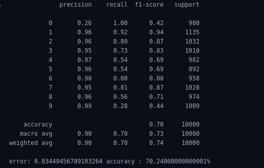
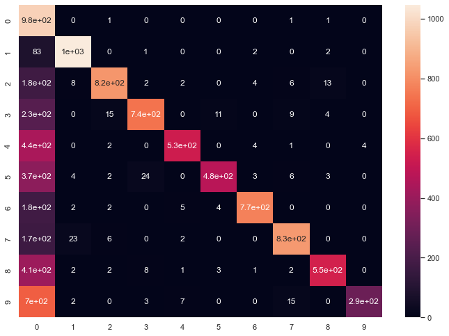
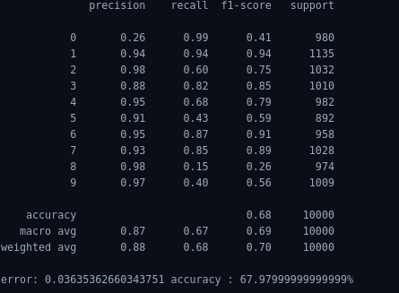
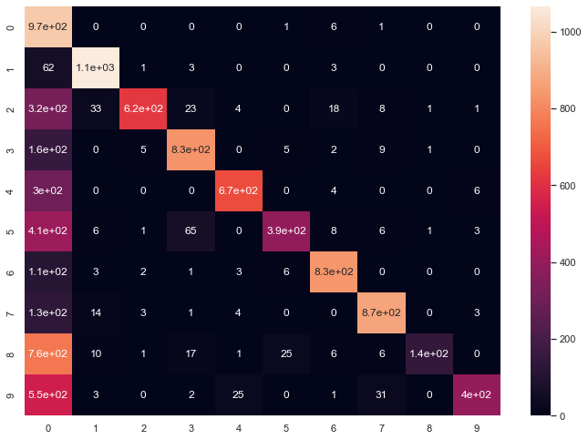

# Implementation of Different Activation functions
 An activation function is a function that is applied to the weighted input (z) at the end of the neuron that helps to learn complex patterns in the neural network in the provided input data. In this task, about 60000 images are used to train the simple neural network model and 10000 images are used for testing purpose while changing activation functions used in the neural network.

## Prerequisites:

- Python needs to install in the system , if not install follow the link to install python in your device. 
  [Install python in Ubuntu](https://phoenixnap.com/kb/how-to-install-python-3-ubuntu)
- **Jupyter lab** 
  Jupyter lab is web based interpreter used for pyhthon programming language. 
  To install jupyter lab 
    - `pip install jupyterlab`
- **NumPy library(>=1.15.0)** 
  NumPy is a library for the Python programming language, adding support for large, multi-dimensional arrays and matrices, along with a large collection of high-level mathematical functions to operate on these arrays. 
  To install numpy 
   - `pip install numpy` 
- **Scikit learn library(>=1.15.0)** 
  scikit learn is a python library with the implementation of a machine learning algorithm. It provides an efficient version of a large number of algorithms. 
  To install scikit learn 
   - `pip install sklean`   

## Run project in terminal
- Download the project from te git
- Open terminal in the location where you have downloaded the project
- Run the following command to open jupyter lab or jupyter notebook in your terminal: 
  `jupyter lab` 
  or 
  `jupyter notebook`
- After Jupyter lab or Jupyter notebooks opens up, select the file with extension **.ipynd**
- When project open up in jupyter lab run everycell from starting to the end 
  
## **Input and Output**
### **Input:**
For Input , about 60000 input image of size 28x28 from MNIST dataset are used for training the regression model and 10000 image for testing of the testing purpose. Image are normalize between -0.5 to 0.5. All two dimensional image are reshaped to one dimensional i.e. **(28,28)** images are reshaped to one dimensional data of shape **(784,)**. 

### **Output:**
### For Sigmoid 
Ouput obtained after training the model with epochs of 100, learning rate of 5 and batch size of 6 with 2 hidden layers each containing 15 nodes each gives error of **0.01659** and accuracy of **90.6%** while training and error of **0.01765** and accuracy of **85.98%**  in testing. Mean Squared error is used as loss function.

Error metrices for the model after passing the testing data to the model is shown below.

Heatmap of confusion matrix 

### For Tanh 
Ouput obtained after training the model with epochs of 100, learning rate of 0.1 and batch size of 6 with 2 hidden layers each containing 15 nodes each gives error of **0.033** and accuracy of **87.91%** while training and error of **0.034** and accuracy of **70.24%**  in testing. Mean Squared error is used as loss function.

Error metrices for the model after passing the testing data to the model is shown below.

Heatmap of confusion matrix 

### For ReLU
Ouput obtained after training the model with epochs of 100, learning rate of 0.1 and batch size of 6 with 2 hidden layers each containing 15 nodes each gives error of **0.0357** and accuracy of **87.31%** while training and error of **0.036** and accuracy of **68%**  in testing. Mean Squared error is used as loss function.

Error metrices for the model after passing the testing data to the model is shown below.

Heatmap of confusion matrix 

## **Activation Functions**
An activation function is a function that is applied to the weighted input (z) at the end of the neuron that helps to learn complex patterns in the neural network in the provided input data. 

As weighted input is a weighted sum of the input attached to the neuron so for a neural network with millions of parameters, the output from a neuron without the use of activation function results in a really large value. So the value must be limited using the activation function. Also, the activation function adds nonlinearity as a result complex model can be learned by the model as a linear model won't always find the pattern in the supplied input. 

Features for activation functions

- **Vanishing gradient:** As for the Backpropagation algorithm, we need to calculate the derivative of the activation function while calculating the partial derivative of the cost function with respect to weight for a layer. Derivative for activation functions like Sigmoid, Tanh their gradient lie between 0 and 1 so while using the chain rule for multilayer neural network for weights at the end of layer their partial derivative will be smaller quantity so they won't change or will change is the smaller amount resulting in vanishing gradient problem. So activation function with vanishing gradient problem must be avoided.
- **Computational Expense:** The activation function must be computationally inexpensive as we need our model to be fast.
- **Zero centered:** The activation function must be symmetric to zero as it must be zero centered to avoid gradient shift. 
- **Differentiable:** As mentioned, neural networks are trained using the gradient descent process, hence the layers in the model need to be differentiable or at least differentiable in parts. 

Different activation functions are

- ### **Sigmoid:** 
  Sigmoid activation function uses sigmoid curve which can be calculated by the following formula. 

  $`\large f(x)=\frac{1}{1+exp^{-x}}`$
  
  Derivative of Sigmoid:

   $`\large f'(x)=\frac{exp^{-x}}{(1+exp^{-x})^2}`$
   
  Graphically: 
  [Sigmoid](https://miro.medium.com/max/788/1*qNJyrtuvPi3B2_Ig3ZKk8A.png)

  The output of a single neuron with sigmoid as activation function acts as that of the output of perceptron. For a higher value, f(x) equals 1 and for a higher negative value f(x) equals zero. The difference is that a small change in a neural network with sigmoid as activation function results in a small change in output. 

  Advantages of using sigmoid as activation functions:
  - Small changes in the input result in small changes in output. 
  - Output is limited between 0 and 1 so overshooting won't be an issue.
  - Generally used for binary classification problems as output is between 0 and 1.

  Disadvantages of using sigmoid:
  - Output of the sigmoid is not zero-centered.
  - Suffers from vanishing gradient

- ### **Tanh:** 
  Tanh is an activation function that is similar to that of the sigmoid activation function and addresses one of the issues of the Sigmoid activation function. 

  Mathematically,

  $`\large f(x)=\frac{exp^{x}-exp^{-x}}{exp^{x}+exp^{-x}}`$
  

  Derivative of tanh is 

  $`\large f'(x)=1-(\frac{exp^{x}-exp^{-x}}{exp^{x}+exp^{-x}})^2`$

  Graphically: 
  [Tanh](https://miro.medium.com/max/705/1*xAxnqtg6WGdjEvFX-uH4dQ.png)

  Advantages of using Tanh:
  - Small changes in the input result in small changes in output. 
  - Output is limited between -1 and 1 so overshooting won't be an issue.
  - Output of the tanh is zero-centered as a result less number of epochs is required to obtain minimize cost value.
  - Gradient is stronger as a result similar pattern can be distinguish

  Disadvantages of using Tanh:
  - Suffers from vanishing gradient

- ### **ReLU**: 
  ReLU stands for Rectified Linear Unit is an activation function defined as a positive part of the input.

   Mathematically:

   $`\large f(x)=x^{+}=\max(0,x)`$
   
   Derivative of ReLU:

    $`\large f'(x)=\begin{cases}
      1&if&x>0 \\0&else 
    \end{cases} `$

   In Relu activation any value less than 0 is zero and any value greater than is equals its input value. This function is also called the ramp function. 

   The advantages of Relu over the activation function describe above are:
   - For example, in a randomly initialized network, only about 50% of hidden units are activated (have a non-zero output).
   - Fewer vanishing gradient problems compared to sigmoidal activation functions that saturate in both directions as derivative of the ReLU function result in output either 0 or 1. 
   - Only comparison, addition, and multiplication.
   - ReLU is scale invarient $`\max(0,ax)=a\max(0,x)`$
  
   The disadvantages of Relu are:
   - As the output of Relu is not fixed between some values, sometimes the final output with a multilayer of ReLU might get high.
   - Derivative of ReLU at 0 is not defined. 
   - It is not zero-centered.
   - Dying Relu problem, As the output of ReLU smaller than 0 is zero so for any negative value ReLU outputs 0. So while using Backpropagation the weights and bias associated with that neuron won't get changed as a result neuron acts as a dead neuron. To resolve this issue leaky ReLU is used with a smaller learning rate.

To more about neural network:
- [Activation function](https://machinelearningmastery.com/choose-an-activation-function-for-deep-learning/)
- [About Activation function in towardsdatascience](https://towardsdatascience.com/activation-functions-neural-networks-1cbd9f8d91d6)
- [Article on Activation function](https://arxiv.org/pdf/2004.06632#:~:text=If%20the%20activation%20function%20of,values%20or%20the%20negative%20values.&text=This%20is%20why%20the%20zero,though%20it%20is%20not%20necessary.)
- [About Backpropagation video](https://www.youtube.com/watch?v=iyn2zdALii8&list=PLblh5JKOoLUIxGDQs4LFFD--41Vzf-ME1&index=5)