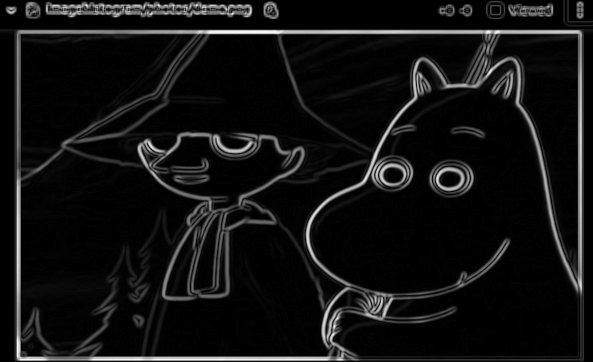
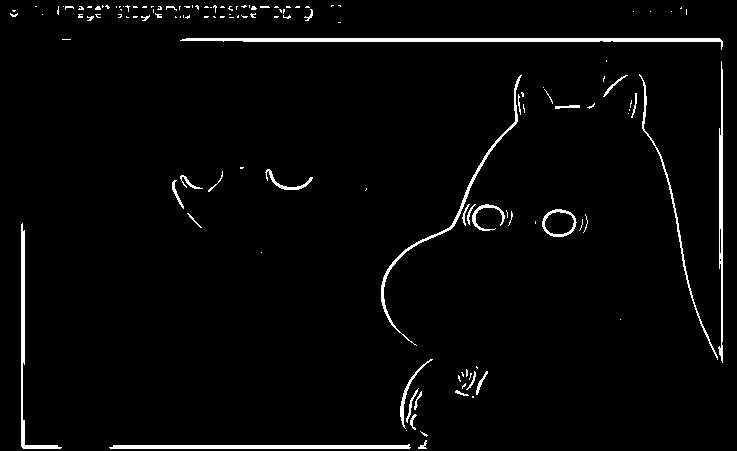
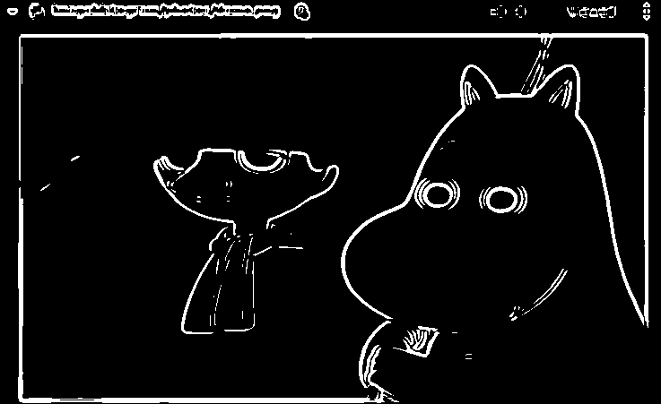

# Apply gradient and  different values of threshold on an image.
## Detection:

In this task, edge detection filter in applied to an image which hightlight change in gradient on an image and detected edge is passed through thresholding algorithm which highlights pixels above certain threshold.

## Prerequisites:
- opencv is required to run this project and if not install follow previous documentation on logistic setup 
- camke is also needed and if not install in your device you can use following syntax to install  
  ***`sudo apt-get install cmake`*** 

## Run the project
- Download the code from the Git
- open the folder you just downloaded in terminal , it contains other folders and files 
- Run ***`cmake -S . -B .`*** command
- After this, Run ***`make`*** command
- executable name **imagethreshold** has been created 
- To check the output, Run ***`./imagethreshold`*** command in terminal
- If user want to apply affine transormation in specific image, the path to the image with name and extension of image should be pass in ***`./imagethreshold pathtotheimage/imagename.extension`*** 
- To close all the window press key **'esc'** from the keyboard

## Input & Output:

Original Image: 

Ouput image after appy Gaussian Blur from scratch: 

Ouput image after appy sobel filter from scratch: 

Ouput image after appy threshold of 200: 

Ouput image after appy threshold of 150: 

Ouput image after appy threshold of 100: 

## Thresholding
Thresholding is the technique to separate the pixel that we want to analyse from the rest of the image. It is segmentation techinique. In thresholding each pixel of image is compared with the threshold value and if the threshold value is greater than the pixel value then based on threshold type steps are taken. In this project, if image pixel exceeds threshold value then they are set to maximum value i.e. 255.

### Steps involve in thresholding are: 
- **Bluring and smoothing:** 
  
  Before thresholding we need to detect edge of an image. So to do that edge detection algorithm is to be applied. As image contains unnecessary data which acts as noise while using edge detection algorithm. So we need to smooth out image so that noise can be supressed from being detected while using edge detection algorithm. We use **Gaussian Blur** in order to blur the image. 
  Gaussian kernel of size provided is created using the formula. 
  $`G(x,y)=1/(2*\Pi*\sigma^2) * {e}^{-(x^2+y^2)/(2*\sigma^2)}`$ 
  Here x and y is location of the pixel. As Gaussian curve has higher value at pixel (0,0) and we need to make central pixel of kernel higher than any other pixels so that while applying filter in image central pixel of image has higher weight causing output to have higher influence of central pixel. In order to make central pixel of higher weight when gaussian pixel is applied to the image, Central pixel of kernel is made maximum. To do so that each pixel coordinate is subracted form middle coordinate of kernel. 

  For Gaussian kernel, sum of all pixels value inside the kernel must add to 1. So to normalize the kernel, all the value obtained after applying above given formula is added up. The value obtained after adding all those terms is used to divide every terms inside the filter in order to normalize the whole filter.

- **Sobel operation:** 
  
  After bluring and smoothing of an image we apply sobel peration to find the gradient intensity. In sobel operation vertical and horizontal edge detection are use to determine the edge and after that the resultant gardient value is obtain. 
    This is 3 * 3 sobel filter used for vertical edge detection 
  $`
  \left(\begin{array}{cc} 
  1 & 0 & -1\\
  2 & 0 & -2\\
  1 & 0 & -1
  \end{array}\right)
  `$

   These kernels are convolve with image to obtain output wich contain image which highlights 
   horizontal and vertical edge.
   These two output are combine using following formula to obtain final result. 
   $`G= \sqrt{Gx^2+Gy^2}`$ 
   where Gx is ouput from vertical edge detction and Gy is ouput from horizontal edge detection.
   G gives the value for each pixel in obtain image. Based on change in gradient or pixel intensity value of G is determine. Sharpe change in intensity higher value of G. 

  Obtained output is to be normalize between 0 to 255 so that we can used output of edge detection in thresholding.

- **Thresholding:** 
  
  Thresholding is the technique to separate the pixel that we want to analyse from the rest of the image. It is segmentation techinique. If image pixels exceeds certin threshold value then, they are set to max value i.e 255 if not then set to zero. 

***To study more about the thresholding and edge detection here are some links:*** 
[About Sobel filter](https://www.tutorialspoint.com/dip/sobel_operator.htm) 
[About thresholding](https://docs.opencv.org/3.4.12/db/d8e/tutorial_threshold.html)

