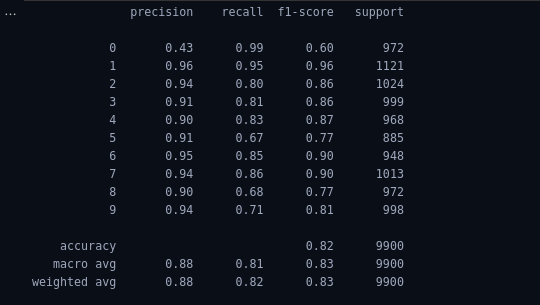
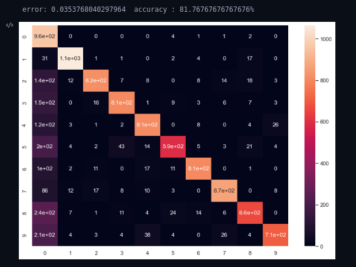
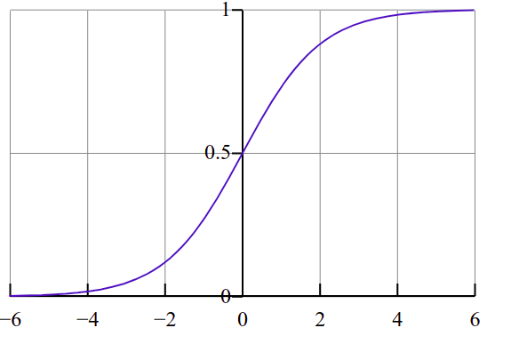

# Implementation of Logistic Regression
Logistic Regression is one of the regression algorithm which classify input data into one of the output label. In this task, about 60000 images are used to train the simple regression model and 10000 images are used for testing purpose

## Prerequisites:

- Python needs to install in the system , if not install follow the link to install python in your device. 
  [Install python in Ubuntu](https://phoenixnap.com/kb/how-to-install-python-3-ubuntu)
- **Jupyter lab** 
  Jupyter lab is web based interpreter used for pyhthon programming language. 
  To install jupyter lab 
    - `pip install jupyterlab`
- **NumPy library(>=1.15.0)** 
  NumPy is a library for the Python programming language, adding support for large, multi-dimensional arrays and matrices, along with a large collection of high-level mathematical functions to operate on these arrays. 
  To install numpy 
   - `pip install numpy` 
- **Scikit learn library(>=1.15.0)** 
  scikit learn is a python library with the implementation of a machine learning algorithm. It provides an efficient version of a large number of algorithms. 
  To install scikit learn 
   - `pip install sklean`   
- **Seaborn library(>=1.0)** 
- Seaborn is a Python data visualization library based on matplotlib. It provides a high-level interface for drawing attractive and informative statistical graphics. 
  To install seaborn 
   - `pip install seaborn` 

## Run project in terminal
- Download the project from te git
- Open terminal in the location where you have downloaded the project
- Run the following command to open jupyter lab or jupyter notebook in your terminal: 
  `jupyter lab` 
  or 
  `jupyter notebook`
- After Jupyter lab or Jupyter notebooks opens up, select the file with extension **.ipynd**
- When project open up in jupyter lab run everycell from starting to the end 

## Input & Output

### Input:
For Input , about 60000 input image of size 28x28 from MNIST dataset are used for training the regression model and 10000 image for testing of the testing purpose. Image are normalize between -0.5 to 0.5. All two dimensional image are reshaped to one dimensional i.e. **(28,28)** images are reshaped to one dimensional data of shape **(784,)**. 

### Output:
Ouput obtained after training the model with epochs of 75, learning rate of 0.2 and batch size of 10 gives error of **0.030** and accuracy of **83.71%**. 

Heatmap of confusion matrix and error metrices for our model after passing the testing data to our model is shown below.

Here from this error metrices we can see that the accuracy of out model is **0.82** or **82%** and error is **0.035**. The f1_socre is harmonic mean of precision and recall. Precision gives how many selected items are relevant and recalls give out of all relevant data how many of them are selected. So for output label **0**, we get precision of 0.46 and that means out 100 input datas labeled as 0 only 46 of them are correctly labeled. we get recall of 0.99 that means out of 100 images of zeros as input data our model predicted 99 of them as zero. Precision is low as any digits that are not identifed as any of the number is labeled as zero which we can see through the heatmap of cinfusion matrix. 

## Logistic Regression

### Regression
Regression is statistical process that is used to establish relation between dependent variable and two or more independent variable. Using one or more than one independent variable, dependent variable is predicted. One of type of Regression that is widely used for classification purpose is logistic regression. 
### Logistic Regression
Logistic Regression is Regression that establishes relation between categorical dependent variable and one or mode than one independent variable . Logistic Regression instead of fitting line to the data it fits logistic function to the data. Output of logistic function range from 0 to 1. 

Logistic Function is common **S** shaped curve (sigmoid curve) with function 

 $`\large
 f(x)={\frac {L}{1+e^{-k(x)}}}`$
 
 

There are two type of logistic Regression model.
- Simple logistic Regression model 
  In simple logistic Regression model, Ouput is dependent upon only one input independent variable

  $`\large
  p={\frac {1}{1+e^{-(\beta _{0}+\beta _{1}x_{1})}}}=S_{b}(\beta _{0}+\beta _{1}x_{1})
  `$

- Multiple loggistic regression model:
  In multiple logistic regression model, Ouput is dependent upon only more than one input independent variable

  $`\large
  p={\frac {1}{1+e^{-(\beta _{0}+\beta _{1}x_{1}+\beta _{2}x_{2}+...)}}}=S_{b}(\beta _{0}+\beta _{1}x_{1}+\beta _{2}x_{2}+...)
  `$

  Here S is sigmoid function which is also called logistic funtion whose output only goes from zero to one.

$`\text{Hypothesis=}(\beta _{0}+\beta _{1}x_{1}+\beta _{2}x_{2}+...)`$

Hypothesis are output obtained after weighting input data i.e x1, x2 with parameters $`\beta_{0} , \beta{1}`$ and by tweaking value of these parameters we are able to fit logistic function to our model such that it achieve maximum likelihood. 

General Logistic Regression model

$`\begin{aligned}
&h_{\theta }(X)={\frac {1}{1+e^{-\theta ^{T}X}}}=\Pr(Y=1\mid X;\theta )\\
&\text{Where}\\
&\theta ^{T} \text{ is model parameter}\\
&x \text{ is input data}\\
&\Pr(Y=1\mid X;\theta ) \text{  Probability that output Y is 1 given X and }\theta
\end{aligned}
`$

### Loss function 
Loss function are one of the simple method of evaluating how well your algorithm models your dataset. If your predictions are totally off, your loss function will output a higher number. If they’re pretty good, it’ll output a lower number. In Logistic Regression, We use following loss function to identify whether our model is working well for specific input data or not. 

$`\begin{aligned}
&L = - Y *h_{\theta }(X) - (1-Y)(1-h_{\theta }(X))\\
\end{aligned}
`$

Here Y is actual output and h is predicted output. If both predicted and actual output doesnot match up the loss will be high for a single input otherwise will be low. If we add this up for all the input we will get the cost function i.e

$`\large {\begin{aligned}
J(\theta \mid y;x)=\frac{1}{m}\sum_{i=1}^m\log{h_{\theta }(x_{i})}*y_{i}-(1-\log{h_{\theta }(x_{i})})*(1-y_{i})
\end{aligned}}
`$

## Gradient descent
Gradient descent is a first-order iterative optimization algorithm for finding a local minimum of a differentiable function. The idea is to take repeated steps in the opposite direction of the gradient (or approximate gradient) of the function at the current point, because this is the direction of steepest descent. Gradient descent algorithm is use to minimize value of cost function by changing parameter value.

Mathematically gradient descent is used as follow 

$`\large \begin{aligned} &\theta_{j}=\theta_{j}-\mathbf{a} \frac{d(J(\theta \mid y;x))}{d\theta_{j}}\\
&\text{Where}\\
&\mathbf{a} \text{ is learning rate}\\
&\theta_{j} \text{ is model parameter}\\
&\frac{d(J(\theta \mid y;x))}{d\theta_{j}} \text{ is difference of cost function}
 \end{aligned}`$

