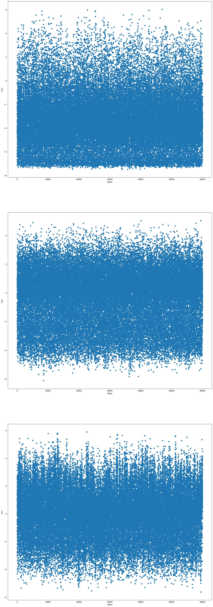
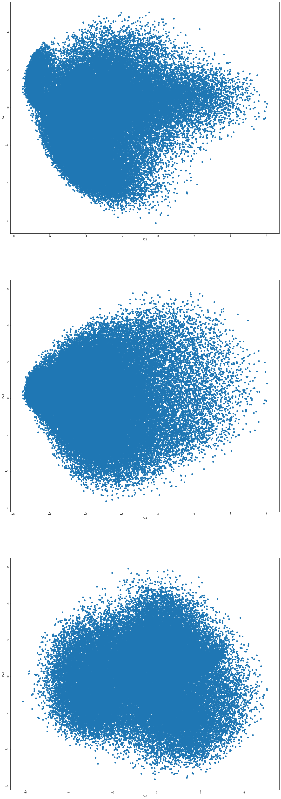

# Implementation of Principal Component Analysis 
Logistic Regression is one of the regression algorithm which classify input data into one of the output label. In this task, about 60000 images are used to train the simple regression model and 10000 images are used for testing purpose

## Prerequisites:

- Python needs to install in the system , if not install follow the link to install python in your device. 
  [Install python in Ubuntu](https://phoenixnap.com/kb/how-to-install-python-3-ubuntu)
- **Jupyter lab** 
  Jupyter lab is web based interpreter used for pyhthon programming language. 
  To install jupyter lab 
    - `pip install jupyterlab`
- **NumPy library(>=1.15.0)** 
  NumPy is a library for the Python programming language, adding support for large, multi-dimensional arrays and matrices, along with a large collection of high-level mathematical functions to operate on these arrays. 
  To install numpy 
   - `pip install numpy` 
- **Scikit learn library(>=1.15.0)** 
  scikit learn is a python library with the implementation of a machine learning algorithm. It provides an efficient version of a large number of algorithms. 
  To install scikit learn 
   - `pip install sklean`   
- **Seaborn library(>=1.0)** 
- Seaborn is a Python data visualization library based on matplotlib. It provides a high-level interface for drawing attractive and informative statistical graphics. 
  To install seaborn 
   - `pip install seaborn` 

## Run project in terminal
- Download the project from te git
- Open terminal in the location where you have downloaded the project
- Run the following command to open jupyter lab or jupyter notebook in your terminal: 
  `jupyter lab` 
  or 
  `jupyter notebook`
- After Jupyter lab or Jupyter notebooks opens up, select the file with extension **.ipynd**
- When project open up in jupyter lab run everycell from starting to the end 

## Input and Output
### Input 

For Input , about 60000 input image of size 28x28 from MNIST dataset are used. Image are normalize between -0.5 to 0.5. All two dimensional image are reshaped to one dimensional i.e. **(28,28)** images are reshaped to one dimensional data of shape **(784,)**. These 784 are the feature vector for an imput image. 

### Ouput

From 784 input dimensions of an input image, using principal component analysis it is reduced to 3 Dimensions, with a variation of 77% from that of original data. The higher the variation higher the data are dispersed and the higher the information. PC1 has a higher variation that means it contains more information than PC2 and so on which we can see in input data and their respective PCA value. In the first Graph, we can see that data along the y-axis is dispersed from 0 which shows that PC1 has higher variation, and variation decreases as we move down the graph.

Below we can see the graph between two principal components. while plotting PC1 and PC2 we can see that data is dispersed whereas while plotting PC2 and PC3 we can see that more data are accumulated at the center. 

## Principal Component Analysis 
PCA is dimensionality reduction method that is often used to reduce the dimensionality of large data sets, by transforming a large set of variables into a smaller one that still contains most of the information in the large set.Reducing dataset may cost the accuracy but dimensionality reduction help better analyse the data and prevents from overfitting the dataset. 

Feature of higher dimesions are converted into principal components of lower dimensions. Principal components are new variables that are constructed as linear combinations or mixtures of the initial variables.These combinations are done in such a way that the new variables (i.e., principal components) are uncorrelated and most of the information within the initial variables is squeezed or compressed into the first components.

### **Steps involve in PCA**

- ### Data normalization:
    Normalizing each of the value in given feature vector , so that some of the feature might not influence whole output of PCA. Even though feature might have less importance , value might be higher as a result it might affect whole output. so data normalization is necessary. 

    Mathematically, this can be done by subtracting the mean and dividing by the standard deviation for each value of each variable.

    $`\large z={\frac {X-\mu }{\sigma }}`$

- ### Covariance matrix calculation:
    Covariance define relation between two variables. Positive sign shows that increment in one variable cause increment in other and vice versa where as negative sign shows that increment in one variable cause decrement in other and vice versa. Covariance between two variables can be computed using following equation:

    $`
    COV(X,Y)={\frac {1}{n-1}}\sum _{i=1}^{n}(x_{i}-\mu(X))(y_{i}-\mu(Y)).
    `$

    Covariance is calculated to obtain relation between variables as a result reduntant information can be ommitted. It is (pxp) symmetric matrix (where p is the dimension) and covariance along the daigonal element of this matrix gives variance of the variable.

    $`\begin{aligned}&COV\_matrix=\begin{bmatrix}
            cov(x,x) & cov(x,y) & cov(x,z) & . & . \\
            cov(x,y) & cov(y,y) & cov(y,z) &. & .\\
            cov(x,z) & cov(y,z) & cov(z,z) & . & .\\
            . & . & . &. & .\\
        \end{bmatrix}\\
        &\text{ where x, y, z are the variables}
        \end{aligned}`$

- ### Compute the Eigenvecotr and Eigenvalue:
    Eigenvector are non zero vector which lie in same span even after the applying linear transformation and Eigenvalue gives by how much linear transformation scale the vector. Eigenvector and Eigenvalue is computed of Covariance matrix to compute principal components. Eigenvector of Covariance matrix always point to the direction with higher variation of data i.e data are more spread out.

    Principal components are new variables that are constructed as linear combinations or mixtures of the initial variables. These combinations are done in such a way that the new variables (i.e., principal components) are uncorrelated and most of the information within the initial variables is squeezed or compressed into the first components. Principal components have a higher variance in the first components and decrease which denotes that data are spread out and has higher information. x features give x principal components, PCA tries to put maximum possible information in the first component, then maximum remaining information in the second and so on.

    Prinicpal components represent the directions of the data that explain a maximal amount of variance. The Principal components with higher variance has higher spread of data as a result contains more information. By ranking eigenvectors in order of their eigenvalues, highest to lowest, principal components in order of significance is obtained.

    In this task, Singular value decomposition is used as it is used for decomposing matrix into three different matrix.

    $`X=\begin{bmatrix}
        . & . & . & . & . \\
        x1 & x2 & . &. & xm\\
        . & . & . & . & . 
    \end{bmatrix}= U \sum V^T`$ 

    Here U and V are orthogonal matrix and $` \sum `$ is diagonal matrix. When decomposing the covariance matrix into three different matrix using SVD , U gives the Eigenvector and $` \sum `$  given their respective Eigenvalue. Eigen vectors in first columns of U has more information about covariance matrix and second column has more information than third. First element of   $` \sum `$ has higher value than second and so on. 

- ### Feature Vector
    After calcualting of Eigenvector and arranging them based on the Eigenvalue , instead of chossing all the Eigenvector only Eigenvector with higher Eigenvalue is selected as higher Eigenvalue higher chance of Eigenvector poiniting to the large variation of data. Feature vector is simply a matrix that has as columns the eigenvectors of the components.

- ### Recast the data along principal axis
    In this step, which is the last one, the aim is to use the feature vector formed using the eigenvectors of the covariance matrix, to reorient the data from the original axes to the ones represented by the principal components .
