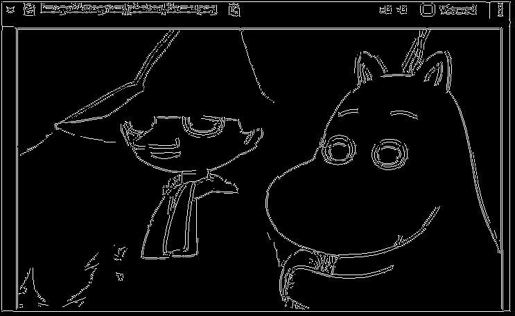

# Implementing Canny Edge Detection

## Detection:

In this task canny operation is to be applied to an image to obtain its edges using python as programming language.

## Prerequisites:

- Python needs to install in the system , if not install follow the link to install python in your device. 
  [Install python in Ubuntu](https://phoenixnap.com/kb/how-to-install-python-3-ubuntu)
- Opencv is required to run this project if not install follow the link provided to install opencv in your device. 
  [Install opencv in Ubuntu](http://www.codebind.com/cpp-tutorial/install-opencv-ubuntu-cpp/) 
- numpy library(>=1.15.0) 
  To install numpy 
   - `pip install numpy` 
- matplotlib library(>=3.3.0) 
  To install matplotlib 
   - `pip install matplotlib` to install matplotlib in your device.

## Run project in terminal
- Download the project from te git
- Open terminal in the location where you have downloaded the project
- Run one of the following command in your terminal: 
  `pyhton3 src/cannyedge.py` 
  or 
  `pyhton src/cannyedge.py`
- If user want to pass their own image the user can pass location of the image along with name and extension of the image.   
   `pyhton3 src/cannyedge.py locationoftheimage/nameoftheimage.extensionoftheimage` 
- To exit the open window press **esc** key from your keyboard

## Input & Output:

Original Image: 

Ouput image after appy prebuilt canny edge detection: 

Ouput image after appy canny edge detection built from scratch: 

## Canny edge detection
Canny edge detection is edge detection process which is widely used for detecting the edges which might be due to ouput with low amount noise compare to other kind of edge detection. Canny edge detection consists of mutiple steps before determining the edge of an image. 
Steps involve in canny edge detection are: 
- Bluring and smoothing: 
  As image contains unnecessary data which acts as noise while using edge detection algorithm. So we need to smooth out image so that noise can be supressed from being detected while using edge detection algorithm. We use **Gaussian Blur** in order to blur the image. 
  Gaussian kernel of size provided is created using the formula. 
  $`G(x,y)=1/(2*\Pi*\sigma^2) * {e}^{-(x^2+y^2)/(2*\sigma^2)}`$ 
  Here x and y is location of the pixel. As Gaussian curve has higher value at pixel (0,0) and we need to make central pixel of kernel higher than any other pixels so that while applying filter in image central pixel of image has higher weight causing output to have higher influence of central pixel. In order to make central pixel of higher value in kernel , (x ,y) value should be (0,0) of central pixel.
- Sobel operation: 
  After bluring and smoothing of an image we apply sobel peration to find the gradient intensity and direction of the edges. In sobel operation vertical and horizontal edge detection are use to determine the edge and after that the resultant gardient value is obtain as well as its direction. 
    This is 3 * 3 sobel filter used for vertical edge detection 
  $`
  \left(\begin{array}{cc} 
  1 & 0 & -1\\
  2 & 0 & -2\\
  1 & 0 & -1
  \end{array}\right)
  `$

   These kernels are convolve with image to obtain output wich contain image which highlights 
   horizontal and vertical edge.
   These two output are combine using following formula to obtain final result. 
   $`G= \sqrt{Gx^2+Gy^2}`$ 
   where Gx is ouput from vertical edge detction and Gy is ouput from horizontal edge detection.
   G gives the value for each pixel in obtain image. If pixel lie on the change in intensity in image which 
   detect edge in an image higher pixel value will be based on value of G. In order to determine in which edge the pixel lie, 
   vertical, horizontal or diagonal we use following formula to calculate angle of edge for each pixel. 
   $`\theta= \arctan(Gy/Gx)`$ 
   If pixel lies in horizontal edge, angle associated it will be 0 or 180 degree and so on

  
- Non max supression: 
  As direction of edge is known across all the pixel so for evey pixel if it lies on any edge then the direction of that edge is known from sobel operation. As change of gradient in the image is perpendicular to the direction of the edge, pixels which are locally maximum in its neighbourhood in the direction of gradient is kept where as all the pixels which are not locally maximum are removed which thin out the edges detected by sobel operation. 
  Each pixels are compared with their neighboring pixels for example , a pixel lie in vertical edge so angle associated with it will be 90 degree. So, pixel will be compared with neighboring pixels in horizontal direction. If the pixel is greater than neighboring pixel then it is left as it is, otherwise 0 is placed in them. Doing this to all the pixel will thin out the edges. 
  Angle between 0 to 22.5 degree as well as angle between 157.5 to 180 degree are consider as 0 degree  
  Angle between 22.5 to 67.5 degree degree are consider as 45 degree  
  Angle between 67.5 to 112.5 degree are consider as 90 degree  
  Angle between 112.5 to 157.5 degree are consider as 135 degree  

- Hysteresis thresholding:
  After thinning the edge and removing unwanted pixels value, we apply thresholding to achieve only the required edge. In this type of thresholding , there are two threshold value ,one threshold value is higher than the other. If edge intensity is greater than the upper threshold value then that edge is kept and are called strong edge. If edge intensity is smaller than the lower threshold value then they are not consider as edge but noise and are removed. Edges which lie between upper and lower threshold value are called weak edge. If weak edge is attach to the strong edge then they are consider as edge of the image but if weak edge are not attach with anything then they are not consider as edge and are removed. 
  Each pixels are compared with upper threshold value and lower threshold value. Pixel value greater or equal to upper threshold is set to max value i.e. 255 and pixel value smaller or equal to lower threshold is set to min value i.e. 0. Pixel value which lie between upper and lower threshold is set either to max or min value based on pixels they are attach to. For example a pixel lie in horizontal edge with angle of 0 degree associate with pixel , if pixel value lies in between upper and lower threshold then the values of pixel the pixel attach to is seen if the value is greater than upper threshold for neighboring pixel then value of the attach pixel is also set to max value i.e. 255  
  let us suppose part of image in which double thresholding with upper threshold 150 and lower threshold to 120 is applied. 
    $`
    \left(\begin{array}{cc} 
    0 & 0 & 0\\
    200 & 127 & 100\\
    0 & 0 & 0
    \end{array}\right)
    `$ 
  In 2nd row we can see 1st pixel with value 200 which is above than threshold value so it is set to 255. Then 2nd pixel in second row is seen ,here we can see the pixel value lie between upper and lower threshold value. we need to check its neighboring pixels as we can see it is attach to pixel with value higher than threshold value so this pixel also obtain max value of 255. Third pixel from 2nd row lie below the lower threshold so it is set to zero.final obtain output will be  
    $`
    \left(\begin{array}{cc} 
    0 & 0 & 0\\
    255 & 255 & 0\\
    0 & 0 & 0
    \end{array}\right)
    `$ 
  Doing this will remove unwanted noise from the ouput image.

To study more about the edge detection here are some links: 
[About Canny edge detector](https://docs.opencv.org/3.4/da/d22/tutorial_py_canny.html) 
[Video link describing canny edge detector](https://www.youtube.com/watch?v=3RxuHYheL4w)

