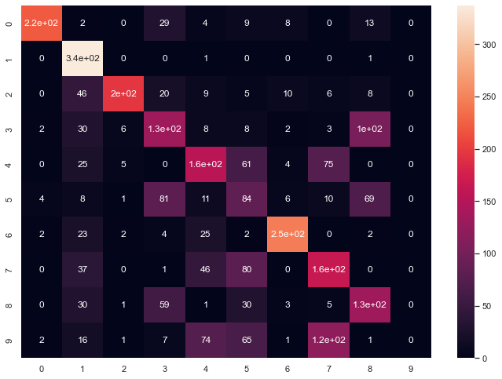

# Implementing K means clustering 
In this task, Images in Mnist dataset are clustered based on K means clustering. The clustered data are compared with actual output and cofusion matrix is created. 

## Prerequisites:

- Python needs to install in the system , if not install follow the link to install python in your device. 
  [Install python in Ubuntu](https://phoenixnap.com/kb/how-to-install-python-3-ubuntu)
- **NumPy library(>=1.15.0)** 
  NumPy is a library for the Python programming language, adding support for large, multi-dimensional arrays and matrices, along with a large collection of high-level mathematical functions to operate on these arrays. 
  To install numpy 
   - `pip install numpy` 
- **Scikit learn library(>=1.15.0)** 
  scikit learn is a python library with the implementation of a machine learning algorithm. It provides an efficient version of a large number of algorithms. 
  To install scikit learn 
   - `pip install sklean`   
- **Seaborn library(>=1.0)** 
- Seaborn is a Python data visualization library based on matplotlib. It provides a high-level interface for drawing attractive and informative statistical graphics. 
  To install seaborn 
   - `pip install seaborn` 
- **Pandas library(>=1.3.3)** 
  Pandas is one of python library which is used for loading, preparing, manipulating, modeling and analysing large amount od data. 
  To install pandas 
   - `pip install pandas`

## Run project in terminal
- Download the project from te git
- Open terminal in the location where you have downloaded the project
- Run one of the following command in your terminal: 
  `pyhton3 main.py` 
  or 
  `pyhton main.py`

## Input & Output:

### Input:
For this project, Mnist dataset which contains images of more that 60000 handwritten digits each of size 28*28 are used for training the model.

### Output 

After tarining the model, the result is confusion matrix obtain after comparing predicted output label with actual label. From confusion matrix, Precision, Recall, F1 Score and Acurracy is caculated.

$`\begin{aligned}
&\text{Confusion matrix}=
\begin{bmatrix}
220  & 2  & 0  & 29 &  4  & 9  & 8  & 0 & 13 &  0\\
0 & 337 &  0  & 0  & 1 &  0  & 0 &  0  & 1  & 0\\
0 & 46 & 195 & 20  & 9 &  5 & 10 &  6 &  8  & 0\\
2 & 30 &  6 & 133 &  8 &  8  & 2 &  3 & 103 &  0\\
0 & 25 &  5 &  0 & 155 & 61 &  4 & 75 &  0  & 0\\
4 &  8  & 1  & 81 & 11 & 84 &  6 & 10 & 69 &  0\\
2 & 23  & 2  & 4 & 25  & 2 & 246 &  0  & 2  & 0\\
0 & 37  & 0  & 1 & 46 & 80 &  0 & 165 &  0  & 0\\
0 & 30  & 1 & 59  & 1 & 30 & 3 &  5 & 132 &  0\\
2 & 16  & 1  & 7 & 74 & 65 &  1 & 120 &  1 &  0\\
\end{bmatrix}
\end{aligned}
`$

Diagnoal value of the Confusion matrix gives correctly predicted output. Row gives actual output as sum of numbers in first row of above matrix gives total images of zero present in our input. Columns gives predicted output as sum of numbers in first column gives total predicted zero by the model.

**Error metrices**

|      | precision | recall | f1-score |
| :--- | :-------- | :----: | :------: |
| 0    | 0.96      |  0.77  |   0.85   |
| 1    | 0.61      |  0.99  |   0.75   |
| 2    | 0.92      |  0.65  |   0.76   |
| 3    | 0.40      |  0.45  |   0.42   |
| 4    | 0.46      |  0.48  |   0.47   |
| 5    | 0.24      |  0.31  |   0.27   |
| 6    | 0.88      |  0.80  |   0.84   |
| 7    | 0.43      |  0.50  |   0.46   |
| 8    | 0.40      |  0.51  |   0.45   |
| 9    | 0.00      |  0.00  |   0.00   |

Above tables gives, value of precision, recall and f1-scrore for all the output. 

Precision gives out of images model predicted , actually how many of them were correct. If we consider first row , precision is 96% that means out of 100 images model classify as zero 96 of them were correct. If there is 100 images of zero, model predicted 77 of them as zero and that is recall of our model. F1-score is harmonic means of precision and recall . For **number 9**, precision as well as recall is zero as non of the image is predicted as **number 9**. F1-score for number 5 is smaller as neither precision nor recall is larger. 

**Accuracy**

Accuracy obtained after training models over 3000 images is about 61%

 
Fig: Heatmap of Confison matrix

## Kmeans clustering 
K means clustering is one of the clustering algorithm where output label for the input is not provided. Datas are clustered based on the pattern of the data. In K means clustering, datasets are clustered based on the distance of data point from the center of the cluster. Smaller the distance from the center, the higher the chance of the data existing in the cluster.

K defines numbers of cluster datasets are to be splitter into.

Variation determines the output of different clusters. The increasing number of clusters will surely decrease the variation but the higher value of K variation won't change much.

In k means clustering, At first random data point is consider and euclidean value to the data point is measured from every other data point. Data are assigned to the cluster with a smaller euclidean distance, After all, data points or sample points are clustered, the Mean sample point from all sample points in a cluster is calculated. Now variation from the given cluster is calculated using the calculated mean sample point and previous sample points. The steps is repeated with newer datapoints and this process continues until the variation is smaller or loop has reached the number of iteration provided. 

## Error mertices
### **Confusion matrix**

Confusion matrix is summary of predicted result in classification model. The number of correct and incorrect predictions are summarized with count values and broken down by each class.

|   | Predict T | Predict  F |  
|---|---|---|
| **Actual T** |  Ture positive | False Negative|
| **Actual F**  |  False positive  | Ture Negative|

### **Accuracy:**
Accuracy defines how good is our model to predict correct result. It is ratio of total correctly classfied result to total result.

$`\large
\text{Accuracy}=\frac{\text{Ture positive}+\text{Ture Negative}}{\text{Ture positive}+\text{False Negative}+\text{False Positive}+\text{Ture Negative}}`$

### **Precision:** 
Out of data that our model predict true, how many of them were correct.If false positive has higher effect then we say that model is high recall model.

$`\large
\text{Precision}=\frac{\text{Ture positive}}{\text{Ture positive}+\text{False positive}}`$

### **Recall:**
 Out of data that are true, how many of them were classified as true. If false negative has higher effect then we say that model is high recall model.

$`\large
\text{Recall}=\frac{\text{Ture positive}}{\text{Ture positive}+\text{False Negative}}`$