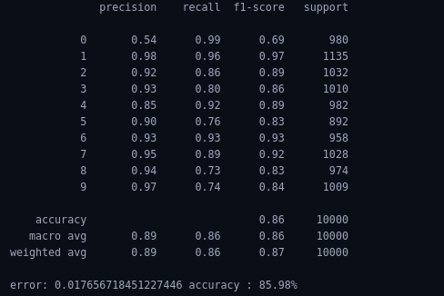
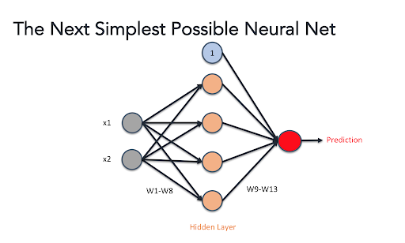

# Implementation of single perceptron neural network 
Neural Network is a set of artificial neurons or nodes that are connected with each others and is responsible for indentifying the underlying pattern in the provided input data. In this task, about 60000 images are used to train the simple neural network model and 10000 images are used for testing purpose.

## Prerequisites:

- Python needs to install in the system , if not install follow the link to install python in your device. 
  [Install python in Ubuntu](https://phoenixnap.com/kb/how-to-install-python-3-ubuntu)
- **Jupyter lab** 
  Jupyter lab is web based interpreter used for pyhthon programming language. 
  To install jupyter lab 
    - `pip install jupyterlab`
- **NumPy library(>=1.15.0)** 
  NumPy is a library for the Python programming language, adding support for large, multi-dimensional arrays and matrices, along with a large collection of high-level mathematical functions to operate on these arrays. 
  To install numpy 
   - `pip install numpy` 
- **Scikit learn library(>=1.15.0)** 
  scikit learn is a python library with the implementation of a machine learning algorithm. It provides an efficient version of a large number of algorithms. 
  To install scikit learn 
   - `pip install sklean`   

## Run project in terminal
- Download the project from te git
- Open terminal in the location where you have downloaded the project
- Run the following command to open jupyter lab or jupyter notebook in your terminal: 
  `jupyter lab` 
  or 
  `jupyter notebook`
- After Jupyter lab or Jupyter notebooks opens up, select the file with extension **.ipynd**
- When project open up in jupyter lab run everycell from starting to the end 
  
## **Input and Output**
### Input:
For Input , about 60000 input image of size 28x28 from MNIST dataset are used for training the regression model and 10000 image for testing of the testing purpose. Image are normalize between -0.5 to 0.5. All two dimensional image are reshaped to one dimensional i.e. **(28,28)** images are reshaped to one dimensional data of shape **(784,)**. 

### Output:
Ouput obtained after training the model with epochs of 100, learning rate of 5 and batch size of 6 with 2 hidden layers each containing 15 nodes each gives error of **0.01659** and accuracy of **90.6%** while training and error of **0.01765** and accuracy of **85.98%**  in testing. Sigmoid is used as activation function along with Mean squared error as loss function.

Error metrices for the model after passing the testing data to the model is shown below.

Heatmap of confusion matrix 

## **Neural Network** 
Neural Network is a set of artificial neurons or nodes that are connected with each others and is responsible for indentifying the underlying pattern in the provided input data. In Neural network, there are multiple input nodes, output nodes and nodes in between them which are hidden. Nodes when organized become a layer in neural network. Any Neural network has single input layer, single output layer but may have more than one hidden layer. 

### **Nodes and Layers**
#### **Nodes**
A node, also called a neuron is a computational unit that has one or more weighted input connections, a transfer function that combines the inputs in some way, and an output connection. Inputs are weighted and based on the importance of input to the output weights is assigned to each input. Here is an example, three weighted inputs are passed into single node which combines all those input and gives single output. Bias is added along with the these weighted input for a given node as it directly effect an ouput . Bias is a measure of how easy it is to get the node to output 1. Higher bais means the output will be high as the bias is added along with the weighted input for given node. The node applies a function f (defined below) to the weighted sum of its inputs as shown in Figure.

The function f is non-linear and is called **Activation Function**. The purpose of the activation function is to introduce non-linearity into the output of a neuron. This is important because most real world data is non linear and we want neurons to learn these non linear representations.

#### **Layers**
Nodes when organized become a layer in neural network. Neural network can have multiple layers and as layers increases, network will be able to take more sophisticated decision. Different types of which are used in Neural networks are
- **Input layer:** Input variables, sometimes called the visible layer.
- **Hidden Layers:** Layers of nodes between the input and output layers. There may be one or more of these layers.
- **Output Layer:** A layer of nodes that produce the output variables. 
  
### **Single Layer Perceptron**
A perceptron is a neural network unit that does a precise computation to detect features in the input data. Perceptron is mainly used to classify the data into two parts. Therefore, it is also known as Linear Binary Classifier.Perceptron uses the step function that returns 1 if the weighted sum of its input is greater than zero.

$` f(\mathbf {x} )=\begin{cases}1&{\text{if }}\ \mathbf {w} \cdot \mathbf {x} +b>0,\\0&{\text{otherwise}}\end{cases}`$

where w is a vector of real-valued weights, $` \mathbf {w} \cdot \mathbf {x} `$ is the dot product $`\sum _{i=1}^{m}w_{i}x_{i}`$, where m is the number of inputs to the perceptron, and b is the bias. Step function is used as activation function to calculate output for a perceptron.

Single-layer perceptron network is simplest kind of neural network , which consists of a single layer of output nodes; the inputs are fed directly to the outputs via a series of weights. The sum of the products of the weights and the inputs is calculated in each node, and if the value is above some threshold (typically 0) the neuron fires and takes the activated value (typically 1); otherwise it takes the deactivated value (typically -1). Single-layer perceptrons are only capable of learning linearly separable patterns.

### **Simple Neural Network**
A simple Neural netork consist of input layer, output layer and single hidden layer. Each node in the single layer connects directly to an input variable and contributes to an output variable.

Here, two input features x1 and x2 are connceted with every nodes from next hidden layer by some weights. For sigle node,output obtained can be written as

$`\begin{aligned}
&O_i=\sigma(\sum _{j=1}^{n}(W_{ji}X_j) + b_i)\\
&\text{where} \\
&O_i = \text{Output of node in ith place}\\
&X_j= \text{Input of node in jth place}\\
&W_{ji}=\text{Weight associated with jth input which is connected to the ith output}\\
&b_{i}=\text{Bias associated with ith output}\\
&\sigma= \text{Activation function}
\end{aligned}`$

In this network, the first column of Nodes (first layer) is making four very simple decisions, by weighing the input evidence. Each of nodes in next layer is making a decision by weighing up the results from the first layer of decision-making. In this way a nodes or perceptron in the second layer can make a decision at a more complex and more abstract level than perceptrons in the first layer. And even more complex decisions can be made by the perceptron in the third layer. In this way, a many-layer network of perceptrons can engage in sophisticated decision making.

Proper value of weights and biases for a neural network will results in desired output and error between actual output and output obtained after passing the input data through neural network will be less. In above example, there are two input nodes , 4 hidden nodes and sngle output nodes so there are less number of weights and biases but for larger neural network there will be many weights and biases as a result it will be impossible to assign proper weight and biases value. So, idea of Back propagation was introduced. 

### **Loss function**
Loss is nothing but a prediction error of Neural Net. The function which is responsible for calculating loss in the neural network is loss function. Loss function used can be different based on neural network problem either it is regression problem or categorical problem. Some of the loss function used in neural network are 
- Mean Squared Error (MSE)
- Binary Crossentropy (BCE)
- Categorical Crossentropy (CC)
- Sparse Categorical Crossentropy (SCC)
   
### **Backpropagation**
Backpropagation is the essence of neural network training. It is the method of fine-tuning the weights of a neural network based on the error rate obtained in the previous epoch (i.e., iteration). Proper tuning of the weights allows you to reduce error rates and make the model reliable by increasing its generalization.

Backpropagation in neural network is a short form for “backward propagation of errors.” It is a standard method of training artificial neural networks. This method helps calculate the gradient of a loss function with respect to all the weights in the network. At the heart of backpropagation is an expression for the partial derivative of the cost function C with respect to any weight w (or bias b) in the network. The expression tells us how quickly the cost changes when we change the weights and biases.Most commonly used backpropagation algorithm is Gradient Descent. 

### Gradient Descent
Gradient Descent is an optimization algorithm for finding a local minimum of a differentiable function (loss fucntion). Gradient descent is simply used in machine learning to find the values of weights and biases (function's parameters) that minimize a cost function as far as possible.

At first weights and biases are initialize randomly then gradient descent uses calculus to minimize cost function by optimizing value of these parameters. 

$`\large \Theta_i=\Theta_i- \alpha*\frac{\partial{J(\theta)}}{\partial{\Theta_i}}`$

Here $`\Theta_i`$ is parameter whose value is optimize so that output of loss function i.e $`J(\theta)`$ will be minimum for given input values. Change in loss func$`\aplha`$ is learning rate ,it determine how fast and how slow model learn.

To more about neural network:
- [neural network ebook](http://neuralnetworksanddeeplearning.com/chap1.html)
- [Neural network videos](https://www.youtube.com/watch?v=aircAruvnKk&list=PLZHQObOWTQDNU6R1_67000Dx_ZCJB-3pi)
- [More Videos on Neural Network](https://www.youtube.com/watch?v=CqOfi41LfDw&list=PLblh5JKOoLUIxGDQs4LFFD--41Vzf-ME1)